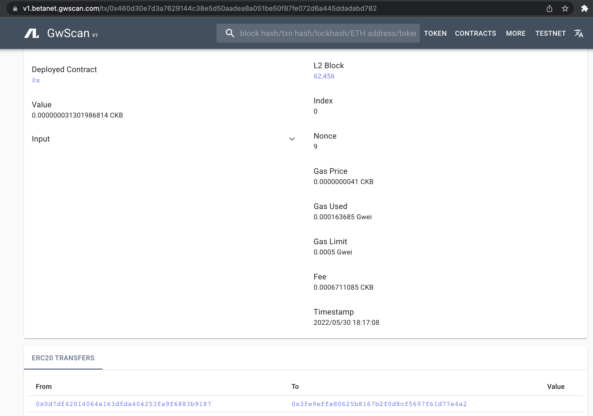
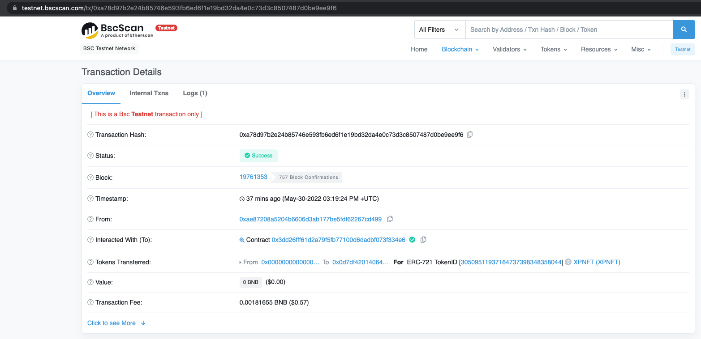
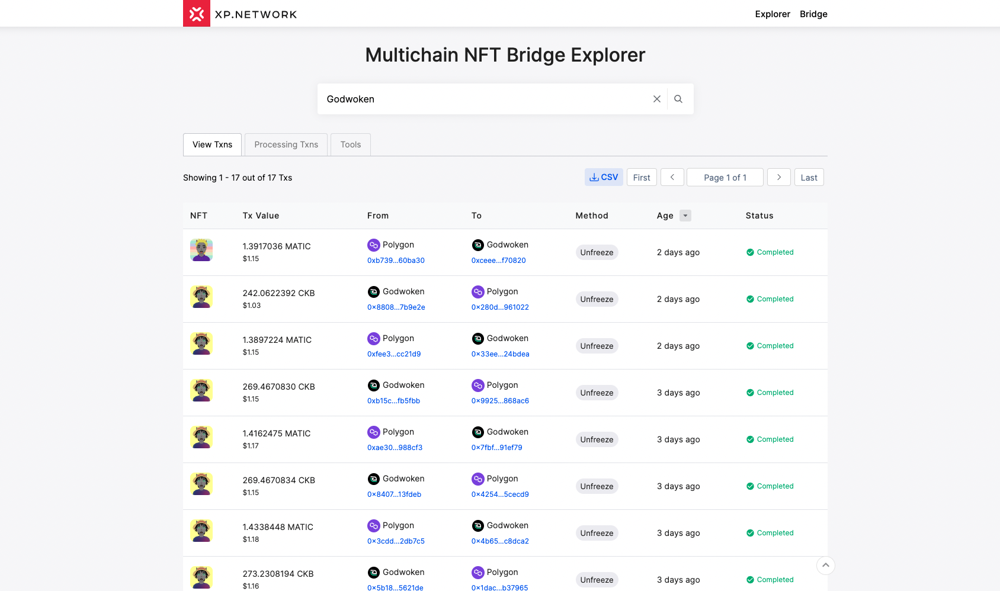
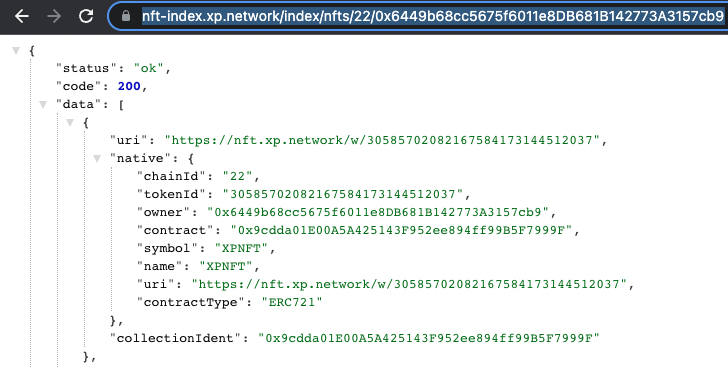
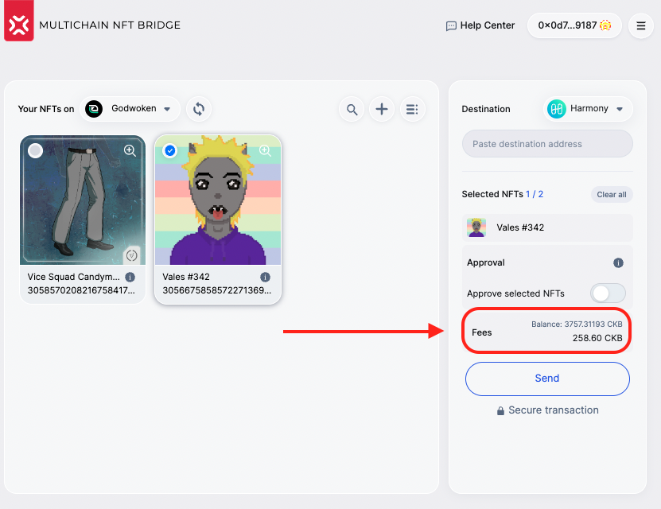
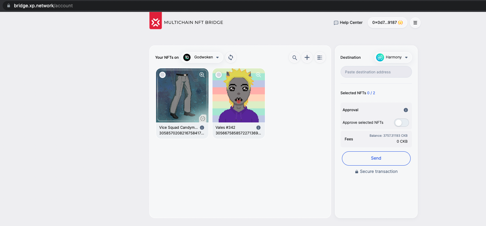
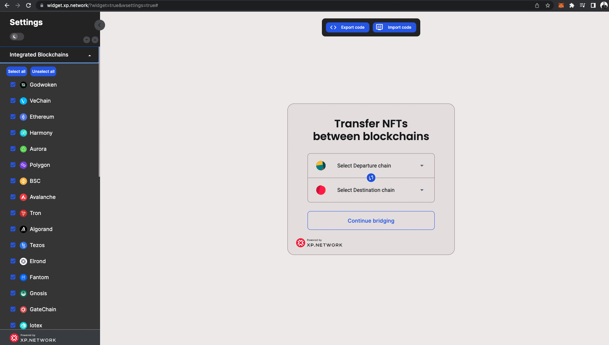

# Layer-2 (EVM) Godwoken Grant Delivery report

## `Milestone 1` — Smart Contract Development

| Length | Deliverable | Specification |
|-|-|-|
| 1 week | Smart Contracts | We have developed smart contracts that can:<br/><br/>1. Support Singe & Batch transfers<br/>2. Freeze/Unfreeze Native NFTs<br/>3. Mint/Burn wrapped NFTs<br/>4. Withdraw the TX fees on the target chain in native tokens<br>5. Trust the multisig of the bridge oracle validators<br/>6. Whitelist NFT smart contracts<br/>7. Pause/Unpause for maintenance or if compromised<br/>8. Reimburse the bridge validators their expenses|

<hr/>

## `Milestone 2` — Testing & Documenting

| Length | Deliverable | Specification |
|-|-|-|
| 1 week | Tests & Documentation | 1. We have provided a basic tutorial how to interact with the deployed smart contracts and backend service.<br/>2.  In the guide, we are describing how to run these tests <br/>3. We've [deployed](#smart-contracts-deployed-on-godwoken-v11) and [tested](#testing-instructions) the contracts in the testnet environment|

### `Smart contracts Deployed on Godwoken v1.1`

|Name|Address|Transaction|Role|
|:-:|:-:|:-:|:-:|
|Bridge SC|[0x3fe9EfFa80625B8167B2F0d8cF5697F61D77e4a2](https://v1.betanet.gwscan.com/account/0x3fe9effa80625b8167b2f0d8cf5697f61d77e4a2)|[TX](https://v1.betanet.gwscan.com/tx/0x153c7473fc6eb6ed3607d7d41c16170b7bd4f07a863bb85c5b91138b16e3deb3)|The main Bridge SC|
|ERC-721 Minter|[0x34933A5958378e7141AA2305Cdb5cDf514896035](https://v1.betanet.gwscan.com/account/0x34933a5958378e7141aa2305cdb5cdf514896035?tab=transactions)|[TX](https://v1.betanet.gwscan.com/tx/0x44012067e3e094d88a86bd65514eb965c375d0b604356431bcafe51ebed8185f)|A contract users can mint 721 with|
|ERC-721 Default|[0x8CEe805FE5FA49e81266fcbC27F37D85062c1707](https://v1.betanet.gwscan.com/account/0x8cee805fe5fa49e81266fcbc27f37d85062c1707)|[TX](https://v1.betanet.gwscan.com/tx/0xe7b086d29a2f98b5542528bbcdb21eaafd6be9d7705af991f482b95bbab7bcab)|Default SC for wrapped 721 NFTs|
|ERC-1155 Minter|[0x9cdda01E00A5A425143F952ee894ff99B5F7999F](https://v1.betanet.gwscan.com/account/0x9cdda01e00a5a425143f952ee894ff99b5f7999f)|[TX](https://v1.betanet.gwscan.com/tx/0xc7ee1cbac2d86ddd790235106601b6e4766db31d635e17453f52850db00080d8)|A contract users can mint 721 with|
|ERC-1155 Default|[0xeBCDdF17898bFFE81BCb3182833ba44f4dB25525](https://v1.betanet.gwscan.com/account/0xebcddf17898bffe81bcb3182833ba44f4db25525)|[TX](https://v1.betanet.gwscan.com/tx/0x8d90afb17d0518313e347e51465ab90ecc4c23cb5c1dc7c6d7cec60e8fd6ea8c)|Default SC for wrapped 721 NFTs|

<hr/>

## `Testing Instructions`

### 1. Installing the brodge library

```ts
yarn add "git+https://github.com/xp-network/xpjs#bleeding-edge" @elrondnetwork/erdjs ethers @taquito/taquito @temple-wallet/dapp
```
### 2. Importing the dependencies

```ts
import {
    ChainFactoryConfigs,
    ChainFactory,
    Chain,
    AppConfigs,
    ChainParams
} from "xp.network";

(async () => {
    // Instantiate the chain factory for the
    // Connecting to the mainnnets of all the blockchains:
    const mainnetConfig = await ChainFactoryConfigs.MainNet()
    const mainnetFactory: ChainFactory = ChainFactory(
        AppConfigs.MainNet(),
        mainnetConfig
    );

    // Connecting to the testnets of all the blockchains:
    const testnetConfig = await ChainFactoryConfigs.TestNet();
    const testnetFactory: ChainFactory = ChainFactory(
        AppConfigs.TestNet(),
        testnetConfig
    );

    // Switching between the mainnets & the testnets:
    const factory: ChainFactory = mainnetFactory;
    const CONFIG: Partial<ChainParams> = mainnetConfig;
})();
```
### 3. Setting up the project

```bash
touch .env
echo "SK=<Replace this with your Private Key>" >> .env
```

```ts
import { Wallet } from "ethers";
import { config } from 'dotenv';
config();
// EVM signer for testing in the BE
const signer = new Wallet(
    process.env.SK!, 
    godwoken.getProvider()
);
```
### 4. Minting an NFT for testing

I bought this [NFT](https://meta.polkamon.com/meta?id=10002366816) for testing purposes.

```ts
const mint = async (departureChain: Web3Helper, uris: String[], contract: string, factory: ChainFactory) => {

    const signer = new Wallet(process.env.SK!, departureChain.getProvider());

    for await (const uri of uris) {

        const nftResult = await factory.mint(
            departureChain,
            signer,
            {
                contract,
                uris: [uri]
            } as NftMintArgs
        );
        console.log(`Done ${uri}`, nftResult);
    }
}

(async () => {
    const URIs1 = [
        "https://meta.polkamon.com/meta?id=10002366816",
        // add more URIs here if you want to mint multiple in a loop
    ];
    await mint(godwoken, URIs1, "0x34933A5958378e7141AA2305Cdb5cDf514896035", factory);
})();
```
Transaction hash: https://v1.betanet.gwscan.com/tx/0x375ad9805f37782b2854c681e185e9638c18e69183d87d9b10b41f67e3f52278


### 5. Listing NFTs on Godwoken

```ts
const nftList = async (departureChain: Web3Helper, chainName: string, factory: ChainFactory) => {

    const signer = new Wallet(process.env.SK!, departureChain.getProvider());
    console.log(`Listing NFTs for ${chainName}:`);

    const NFTs = await factory.nftList(
        departureChain,
        signer.address
    );
    console.log(`On ${chainName} Found NFTs:`, NFTs.length);
    return NFTs;
}

(async () => {
    const godwokenNfts = await nftList(godwoken, "Godwoken", factory);
    selected = godwokenNfts[godwokenNfts.length-1];
    console.log("Selected NFT:", selected);
})();
```
### 6. Transferring NFTs from Godwoken

Once NFTs are listed and there are NFTs you can choose from you can start transferring them.

```ts
const transferNft = async (departureChain: Web3Helper, destinationChain: Web3Helper, selNFT: NftInfo<unknown>, factory: ChainFactory) => {

    const signer = new Wallet(process.env.SK!, departureChain.getProvider());
    console.log(`Transferring NFT...`);

    return await factory.transferNft(
        departureChain,
        destinationChain,
        selNFT,
        signer,
        signer.address,
        undefined,
        undefined,
        500_000
    )
}

(async () => {
    const result = await transferNft(godwoken, bsc, selected, factory);
    console.log("Transfer result:", result);
})();
```
Transaction hash: https://v1.betanet.gwscan.com/tx/0x460d30e7d3a7629144c38e5d50aadea8a051be50f87fe072d6a445ddadabd782



### Vewing wrapped NFT on BSC

Transaction: 

Explorer view:



Wrapped NFTs: https://bridge-wnftapi.herokuapp.com/w/30509511937164737398348358044

```json
{
"name": "Unifairy",
"description": "The Unifairy are the most magical and fairest of Polkamon. Their wings stretch into the realms beyond this world, enchanting those around her by her unique disposition.",
"decimals": 0,
"isBooleanAmount": true,
"image": "https://assets.polkamon.com/images/Unimons_T02C03H06B04G00.jpg",
"artifactUri": "https://assets.polkamon.com/images/Unimons_T02C03H06B04G00.jpg",
"animation_url": "https://assets.polkamon.com/videos/Unimons_T02C03H06B04G00.mp4",
"wrapped": {
"contract": "0x34933A5958378e7141AA2305Cdb5cDf514896035",
"tokenId": "0",
"contractType": 721,
"origin": "22",
"original_uri": "https://meta.polkamon.com/meta?id=10002366816",
"mint_with": "0x783eF7485DCF27a3Cf59F5A0A406eEe3f9b2AaeB",
"source_mint_ident": "0x34933A5958378e7141AA2305Cdb5cDf514896035"
},
"attributes": [
{
"trait_type": "Original Chain",
"value": "Godwoken"
},
{
"trait_type": "Original Chain Nonce",
"value": "22"
},
{
"trait_type": "Original URI",
"value": "https://meta.polkamon.com/meta?id=10002366816"
},
{
"trait_type": "Type",
"value": "Unifairy"
},
{
"trait_type": "Horn",
"value": "Spiral Horn"
},
{
"trait_type": "Color",
"value": "Blue"
},
{
"trait_type": "Background",
"value": "Mountain Range"
},
{
"trait_type": "Opening Network",
"value": "Binance Smart Chain"
},
{
"trait_type": "Glitter",
"value": "No"
},
{
"trait_type": "Special",
"value": "No"
},
{
"display_type": "date",
"trait_type": "Birthday",
"value": 1633650473
},
{
"display_type": "number",
"trait_type": "Booster",
"value": 10000000788939
}
],
"displayUri": "https://assets.polkamon.com/images/Unimons_T02C03H06B04G00.jpg",
"thumbnailUri": "https://assets.polkamon.com/images/Unimons_T02C03H06B04G00.jpg"
}
```

## `Milestone 3` — Integrating into the Live Bridge
| Length | Deliverable | Specification |
|-|-|-|
| 2 weeks | Validators, Backend, Frontend | 1. We've developed the [validation logic](#31-successful-transfers-secured-by-the-brisdge-validators) relevant for the Godwoken part of the bridge<br/>2. We've added Godwoken to the Bridge [NFT-Indexer](#32-godwoken-in-the-nft-indexer)<br/>3. We've integrated TX [fee estimation](#33-fee-estimation)<br/>4. Plugged Godwoken into the [heartbeat](#34-heartbeat)<br/>5. We've integrated with a Godwoken [rpc nodes](#35-integrated-with-rpc-nodes)<br/>6. We've integrated Godwoken in the [bridge UI](#36-godwoken-in-the-bridge-ui)<br/>7. We've deployed [smart contracts on the Mainnet](#37-mainnet-smart-contracts)<br/>8. We've added Godwoken to the bridge [JS library](https://github.com/XP-NETWORK/xpjs/search?q=godwoken)<br/>9. We've added Godwoken to the [bridge widget](#39-godwoken-in-the-bridge-widget)|

### 3.1 Successful transfers secured by the Brisdge Validators



Examples of transactions:

|Origin|Destination|
|:-:|:-:|
|[Polygon](https://polygonscan.com/tx/0xfee3d218f8110592ed8a821fb25cbbd3cd20912322a469becb51633770cc21d9)|[Godwoken](https://v1.gwscan.com/tx/0x33eed44bd6decdf4958fb59387192bc242bf5175ec416321be2b8c4f4d24bdea)|
|[Godwoken](https://v1.gwscan.com/tx/0x8808fc5c7aece8d7c93bc8b8050c84a4fb4562e80ff94dcf2ad247e10a7b9e2e)|[Polygon](https://polygonscan.com/tx/0x280d9fdf9a77bc2d2984f4ee1f28ef468c9e7551aa9ca7cee0fcf0648b961022)|
### 3.2 Godwoken in the NFT-Indexer

22 is the [nonce]() of Godwoken in the bridge.

Request format:
```
https://nft-index.xp.network/index/nfts/22/{account}
```

Request example:

https://nft-index.xp.network/index/nfts/22/0x6449b68cc5675f6011e8DB681B142773A3157cb9

Viewwing NFT Data:



### 3.3 Fee estimation



### 3.4 heartbeat

Heartbeat tool checks:
1. Godwoken nodes are alive & respond normally
2. That the validators have  non zero balance
In case, one of the two is false, the chain is disabled in the UI to prevent tokens from getting stuck.

### 3.5 Integrated with RPC Nodes

Testnet: `https://godwoken-testnet-v1.ckbapp.dev`

Mainnet: `https://v1.mainnet.godwoken.io/rpc`

### 3.6 Godwoken in the Mainnet Bridge UI



### 3.7 Mainnet Smart Contracts

Bridge Contract: `0xeBCDdF17898bFFE81BCb3182833ba44f4dB25525`

Default ERC-721: `0x9cdda01E00A5A425143F952ee894ff99B5F7999F`

Default ERC-1155: `0x34933A5958378e7141AA2305Cdb5cDf514896035`

### 3.8 Godwoken in JavaScript Library

https://github.com/XP-NETWORK/xpjs/search?q=godwoken

### 3.9 Godwoken in the Bridge Widget

